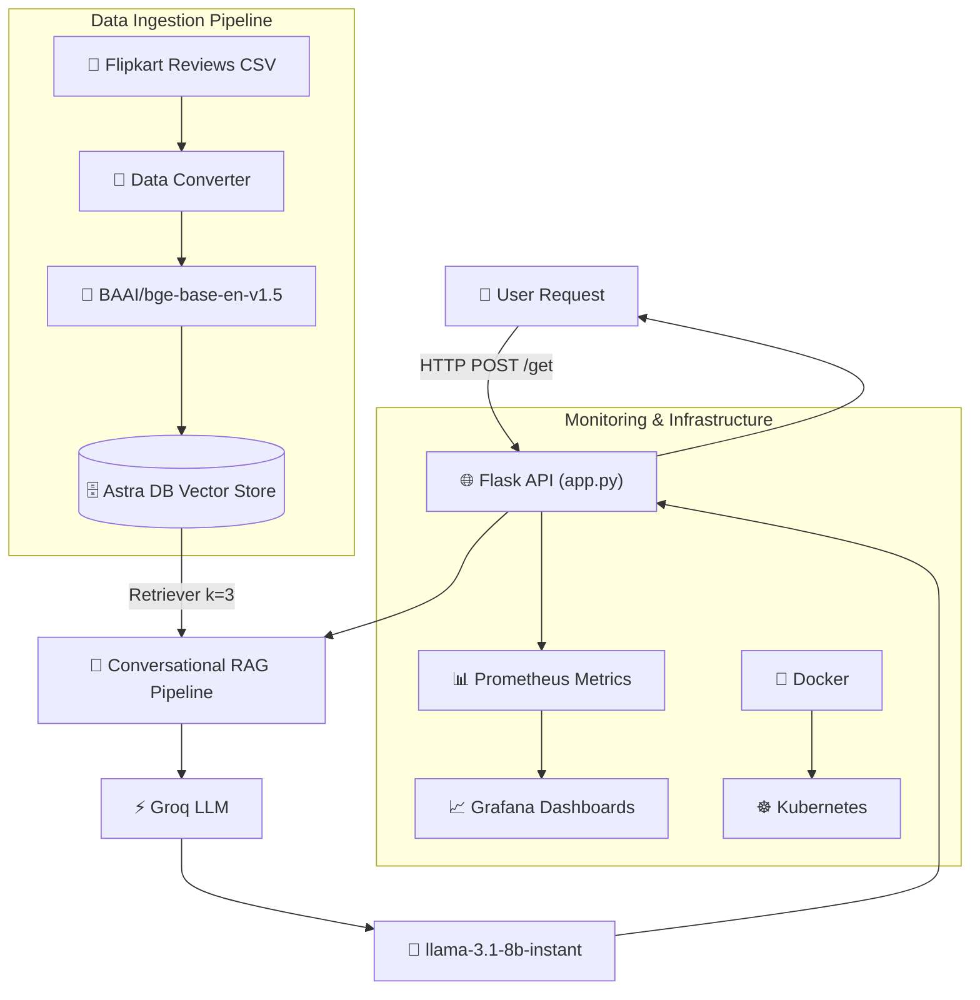

<div align="center">

# 🛒 Flipkart Product Recommender

### Enterprise-Grade AI Recommendation System powered by RAG, Groq, Astra DB, Kubernetes, Prometheus & Grafana


<br>

[](https://python.org)
[](https://flask.palletsprojects.com/)
[](https://python.langchain.com/)
[](https://groq.com)
[](https://www.datastax.com/products/datastax-astra)
[](https://docker.com)
[](https://kubernetes.io)
[](https://prometheus.io/)
[](https://grafana.com/)

</div>

---

# 📖 Executive Overview

**Flipkart Product Recommender** is an enterprise-grade conversational AI recommendation platform engineered using **Retrieval-Augmented Generation (RAG)** architecture, **Groq LLM inference**, and **Astra DB Vector Database**.

The system intelligently retrieves semantically relevant Flipkart product reviews and generates context-aware recommendations using advanced Large Language Model workflows.

This repository demonstrates:
- Generative AI Engineering
- Retrieval-Augmented Generation (RAG)
- Conversational AI Systems
- Vector Database Integration
- LLMOps & MLOps Practices
- Kubernetes-based AI Deployment
- Monitoring & Observability Engineering

The platform is fully containerized using **Docker**, orchestrated via **Kubernetes**, and monitored using **Prometheus and Grafana** for production-grade observability.

> [!IMPORTANT]
> A detailed deployment and infrastructure guide is available in:
>
> ```text
> CODE/FULL DOCUMENTATION.md
> ```

---

# 🌟 Repository Highlights

- Enterprise-grade conversational RAG system
- Astra DB semantic vector retrieval architecture
- Stateful conversational recommendation workflows
- Groq-powered low-latency inference
- Kubernetes-native deployment architecture
- Prometheus & Grafana observability integration
- Dockerized AI infrastructure
- Context-aware recommendation generation
- Production-oriented LLMOps workflow

---

# ✨ Advanced Features

## 🧠 Generative AI & RAG Capabilities

- Conversational Retrieval-Augmented Generation (RAG)
- Context-aware recommendation workflows
- Stateful multi-turn conversation support
- Semantic similarity retrieval pipeline
- Dynamic contextual recommendation generation
- History-aware conversational retrievers
- Prompt-driven response orchestration
- Vector embedding-based retrieval

---

## ⚡ LLM Inference Architecture

### Integrated LLM

| Model | Purpose |
|---|---|
| `llama-3.1-8b-instant` | Low-latency conversational recommendation generation |

### LLM Frameworks

- LangChain
- ChatGroq
- RunnableWithMessageHistory

### AI Workflow Features

- Conversational memory persistence
- Context injection pipelines
- Retrieval-based generation
- Semantic recommendation generation
- Real-time inference execution

---

# 🧠 Why Retrieval-Augmented Generation (RAG)?

Traditional LLMs depend only on pretrained knowledge and may generate hallucinated or outdated responses.

This project implements a **Retrieval-Augmented Generation (RAG)** pipeline to:

- Retrieve contextually relevant Flipkart product reviews
- Ground responses using real product review data
- Improve recommendation relevance
- Reduce hallucinations
- Enable intelligent contextual recommendations
- Maintain conversational context across interactions

The architecture combines:
- Semantic vector embeddings
- Astra DB vector retrieval
- Context-aware prompting
- LLM-based recommendation generation

---

# 🧬 Embedding Pipeline

The recommendation engine uses semantic vector embeddings for intelligent contextual retrieval.

## Embedding Model

```python
BAAI/bge-base-en-v1.5
```

## Embedding Workflow

1. Product reviews are loaded from CSV datasets
2. Review text is converted into vector embeddings
3. Embeddings are stored inside Astra DB Vector Store
4. User queries are semantically matched against stored vectors
5. Relevant review chunks are retrieved
6. Context is passed to the Groq LLM
7. Final recommendations are generated

This enables semantic recommendations instead of traditional keyword matching.

---

# 🗄️ Astra DB Vector Database Integration

The project uses **DataStax Astra DB** as the vector storage layer for semantic retrieval workflows.

## Astra DB Responsibilities

- Vector storage management
- Semantic similarity search
- Context retrieval pipelines
- Embedding indexing
- Scalable vector retrieval

## Advantages of Astra DB

- Managed cloud-native vector database
- High-performance retrieval operations
- Scalable semantic search support
- Optimized vector indexing
- Production-grade reliability

---

# ⚡ LLM Inference Workflow

The recommendation generation workflow follows these stages:

1. User submits recommendation query
2. Flask API receives request
3. Conversational RAG chain initializes
4. Astra DB retriever performs semantic search
5. Relevant review chunks are retrieved
6. Context is injected into the prompt pipeline
7. Groq LLM processes retrieved context
8. Recommendation response is generated
9. Final response returned to frontend

This architecture enables low-latency, context-aware recommendation generation.

---

# 🛠️ Technology Stack

| Layer | Technologies |
|---|---|
| Backend Framework | Flask |
| AI Framework | LangChain |
| LLM Provider | Groq |
| LLM Model | llama-3.1-8b-instant |
| Vector Database | Astra DB |
| Embedding Model | BAAI/bge-base-en-v1.5 |
| Containerization | Docker |
| Orchestration | Kubernetes |
| Monitoring | Prometheus, Grafana |
| Deployment | Minikube |
| Conversational Memory | RunnableWithMessageHistory |

---

# 🏗️ System Architecture



---

# 📈 Scalability Features

The platform is designed using scalable AI infrastructure principles:

- Stateless Flask backend
- Containerized deployment workflows
- Kubernetes-native orchestration
- Scalable vector database integration
- Modular RAG pipeline architecture
- Environment-based configuration isolation
- Cloud-ready deployment support
- Independent monitoring stack

---

# 📊 Observability Architecture

The platform includes integrated observability support for monitoring AI inference and infrastructure health.

## Monitoring Stack

- Prometheus metrics collection
- Grafana visualization dashboards
- Kubernetes monitoring support
- Flask HTTP telemetry exposure

## Metrics Tracked

- HTTP request metrics
- API response latency
- Model inference timings
- Container health metrics
- Kubernetes deployment health

---

# 🏆 AI Engineering Highlights

- Conversational Retrieval-Augmented Generation
- Astra DB semantic vector retrieval
- Stateful conversational memory workflows
- Groq-powered low-latency inference
- Semantic embedding pipelines
- Kubernetes AI deployment architecture
- Monitoring-enabled AI infrastructure
- Production-oriented LLMOps implementation

---

# ⚡ Engineering Challenges Solved

- Conversational context persistence
- Semantic retrieval optimization
- Vector database integration
- Low-latency recommendation generation
- Kubernetes deployment orchestration
- Monitoring AI workloads
- Scalable AI infrastructure management
- Real-time contextual recommendation handling

---

# 🔐 Security Features

- Environment variable isolation using `.env`
- Kubernetes secret-based credential management
- Secure API token handling
- Docker container isolation
- Infrastructure-level deployment separation

---

# 📂 Project Structure

```bash
📦 FLIPKART_PRODUCT_RECOMMENDER
 ┣ 📂 CODE
 ┃ ┣ 📂 Architecture/           # System workflow diagrams
 ┃ ┣ 📂 data/                   # Flipkart product datasets
 ┃ ┣ 📂 flipkart/               # Core AI modules
 ┃ ┃ ┣ 📜 config.py             # Model & environment configuration
 ┃ ┃ ┣ 📜 data_converter.py     # CSV to document conversion
 ┃ ┃ ┣ 📜 data_ingestion.py     # Astra DB vector ingestion
 ┃ ┃ ┗ 📜 rag_chain.py          # Conversational RAG pipeline
 ┃ ┣ 📂 grafana/                # Grafana Kubernetes manifests
 ┃ ┣ 📂 Outputs/                # Application outputs & screenshots
 ┃ ┣ 📂 prometheus/             # Prometheus configurations
 ┃ ┣ 📂 static/                 # Static CSS/JS assets
 ┃ ┣ 📂 templates/              # Frontend HTML templates
 ┃ ┣ 📜 app.py                  # Main Flask application
 ┃ ┣ 📜 Dockerfile              # Docker image configuration
 ┃ ┣ 📜 flask-deployment.yaml   # Kubernetes deployment manifest
 ┃ ┣ 📜 FULL DOCUMENTATION.md   # Infrastructure guide
 ┃ ┣ 📜 requirements.txt        # Dependencies
 ┃ ┗ 📜 setup.py                # Package installer
 ┗ 📜 README.md
```

---

# 📸 Outputs & Demonstrations

## 🚀 Deployed Application


---

## 💬 Conversational Recommendation Output


---

## 🗄️ Astra DB Vector Store


---

## ☁️ VM Infrastructure Setup


---

## ☸️ Kubernetes Initialization


---

# 🚀 Quick Start & Deployment

## 1️⃣ Clone Repository

```bash
git clone https://github.com/pamuarun/FLIPKART_PRODUCT_RECOMMENDER.git
cd FLIPKART_PRODUCT_RECOMMENDER/CODE
```

---

## 2️⃣ Install Dependencies

```bash
pip install -r requirements.txt
pip install -e .
```

---

## 3️⃣ Configure Environment Variables

Create a `.env` file:

```env
ASTRA_DB_API_ENDPOINT=...
ASTRA_DB_APPLICATION_TOKEN=...
ASTRA_DB_KEYSPACE=...
GROQ_API_KEY=...
HF_TOKEN=...
```

---

## 4️⃣ Run Application

```bash
python app.py
```

---

# ☸️ Kubernetes & Docker Deployment

## Build Docker Image

```bash
docker build -t flask-app:latest .
```

---

## Apply Kubernetes Manifests

```bash
kubectl apply -f flask-deployment.yaml

kubectl apply -f prometheus/prometheus-configmap.yaml

kubectl apply -f prometheus/prometheus-deployment.yaml

kubectl apply -f grafana/grafana-deployment.yaml
```

---

## Access Services

```bash
kubectl port-forward svc/flask-service 5000:80 --address 0.0.0.0

kubectl port-forward svc/grafana-service 3000:3000 --address 0.0.0.0
```

---

# 🚀 Future Enhancements

- Hybrid recommendation pipelines
- Personalized conversational memory
- Multi-vector retrieval strategies
- Recommendation reranking models
- Cloud-native autoscaling
- Recommendation analytics dashboards
- Multi-LLM orchestration support
- Advanced observability integrations

---

# 📖 Infrastructure Documentation

Detailed setup instructions are available inside:

```text
CODE/FULL DOCUMENTATION.md
```

Documentation includes:
- VM setup
- Docker installation
- Kubernetes initialization
- Minikube configuration
- Astra DB setup
- Prometheus setup
- Grafana deployment
- Flask deployment workflows

---

# 🌍 Real-World Applications

- E-commerce recommendation systems
- Conversational shopping assistants
- AI-powered product discovery
- Semantic recommendation engines
- Context-aware customer support systems

---

# 🛡️ License & Contributions

This project demonstrates enterprise-grade AI recommendation engineering using RAG, Astra DB, Groq, Kubernetes, and observability workflows.

Contributions, feature requests, and improvements are welcome.

---

<div align="center">

### 🚀 Built with Generative AI, RAG, Astra DB, Kubernetes & LLMOps Engineering

</div>